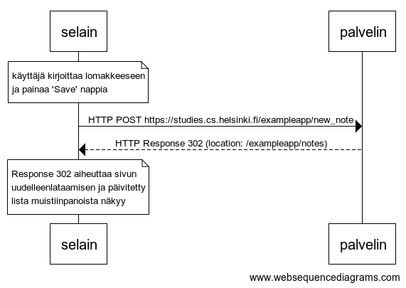

# 0.4: uusi muistiinpano

> Tee vastaavanlainen kaavio, joka kuvaa mitä tapahtuu tilanteessa, missä käyttäjä luo uuden muistiinpanon ollessaan sivulla https://studies.cs.helsinki.fi/exampleapp/notes, eli kirjoittaa tekstikenttään jotain ja painaa nappia tallenna.



```
note over selain:
käyttäjä kirjoittaa lomakkeeseen
ja painaa 'Save' nappia
end note

selain->palvelin: HTTP POST https://studies.cs.helsinki.fi/exampleapp/new_note
palvelin-->selain: HTTP Response 302 (location: /exampleapp/notes)

note over selain:
Response 302 aiheuttaa sivun
uudelleenlataamisen ja päivitetty
lista muistiinpanoista näkyy
end note
```
