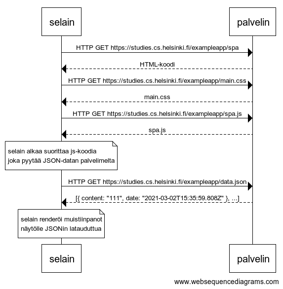

# 0.5: Single Page App

> Tee kaavio tilanteesta, missä käyttäjä menee selaimella osoitteeseen https://studies.cs.helsinki.fi/exampleapp/spa eli muistiinpanojen Single Page App-versioon

---



```
selain->palvelin: HTTP GET https://studies.cs.helsinki.fi/exampleapp/spa
palvelin-->selain: HTML-koodi
selain->palvelin: HTTP GET https://studies.cs.helsinki.fi/exampleapp/main.css
palvelin-->selain: main.css
selain->palvelin: HTTP GET https://studies.cs.helsinki.fi/exampleapp/spa.js
palvelin-->selain: spa.js

note over selain:
selain alkaa suorittaa js-koodia
joka pyytää JSON-datan palvelimelta
end note

selain->palvelin: HTTP GET https://studies.cs.helsinki.fi/exampleapp/data.json
palvelin-->selain: [{ content: "111", date: "2021-03-02T15:35:59.808Z" }, ...]

note over selain:
selain renderöi muistiinpanot
näytölle JSONin latauduttua
end note
```
