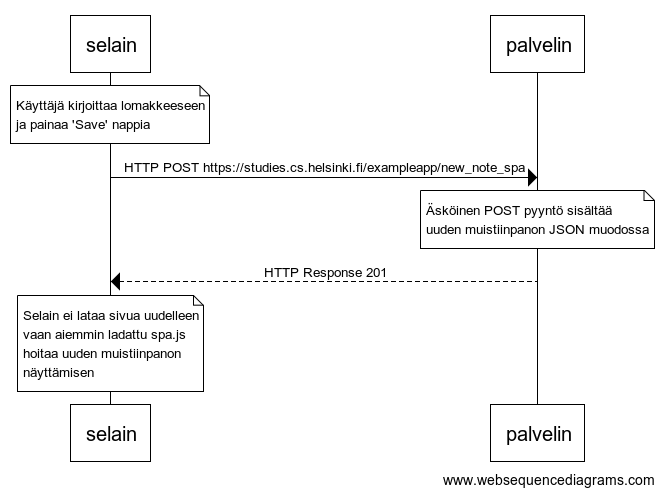

# 0.6: Uusi muistiinpano

> Tee kaavio tilanteesta, missä käyttäjä luo uuden muistiinpanon single page -versiossa.

---



```
note over selain:
Käyttäjä kirjoittaa lomakkeeseen
ja painaa 'Save' nappia
end note

selain->palvelin: HTTP POST https://studies.cs.helsinki.fi/exampleapp/new_note_spa

note over palvelin:
Äsköinen POST pyyntö sisältää
uuden muistiinpanon JSON muodossa
end note

palvelin-->selain: HTTP Response 201

note over selain:
Selain ei lataa sivua uudelleen
vaan aiemmin ladattu spa.js
hoitaa uuden muistiinpanon
näyttämisen
end note
```
